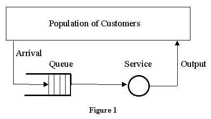
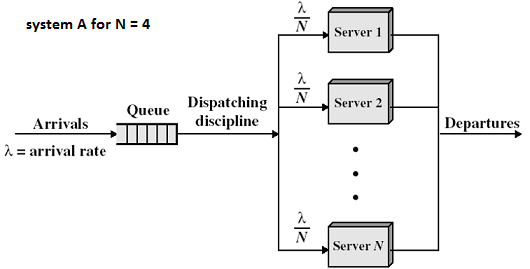
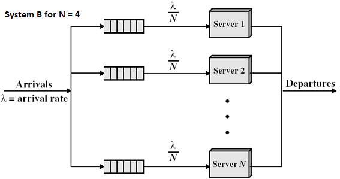
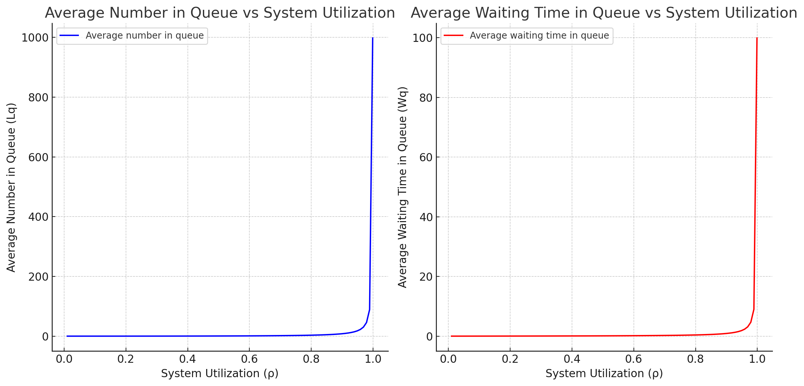
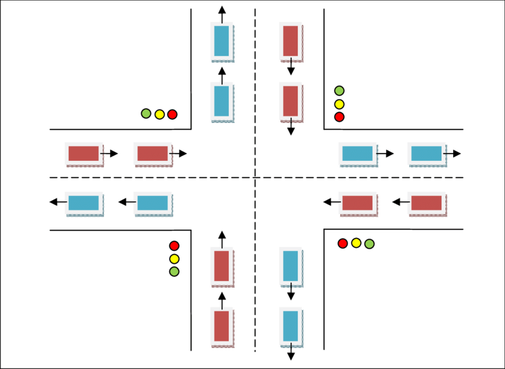
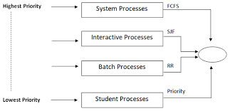
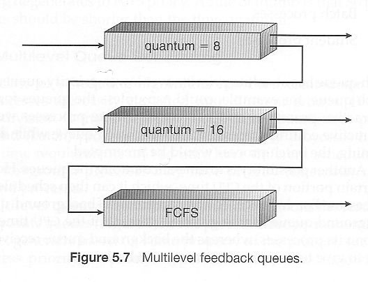

# Unit 3: Queuing System

### Queue
> *Q. What do you mean by Queuing system. Explain the charcteristis of queing system with example.*
- The line where the entities or customer wait is generally known as queue.
- The combination of all entities in system being served and being waiting for service will be called as queuing system.





- The key elements of queuing systems are customer and server.
- Customer refers to anything that arrives at a faculty and requires service. Example: People, machine, Trucks, Emails
- Server refers to any resources that provides the requested service. Example: Receptionist, Teller, CPU, Washing Machine etc.

## Characteristics of Queuing system
1. Calling Population
2. Arrival Process
3. Service Process
4. Queuing Discipline and Queuing behaviour
5. Number of Servers

### 1. Calling Population
- The population of potential customer those require service from system is called calling population.
- It may be finite or infinite.
    - System having large calling population is usually considered as infinite. Example: Customer at Banks.
    - Any system having less and countable population is considered as finite. Example: A certain number of machines to be repaired by service man.
- In finite population, arrival rate depends on the number of customers being served and waiting. But in infinite population model, arrival rate is not affected by the number of customers being served and waiting.


### 2. Arrival Process
- The arrival process of infinite population model is usually characterized in terms of arrival times of successive customers.
- Arrivals may occur at scheduled times or at random times.
- When at random times, the inter-arrival times are usually characterized by 4 probability distribution and most important model for random arrival is the poisson process.
- In scheduled arrival, the inter-arrival time of customer is constant.

### 3. Service Process
- Service process can be measured by number of customers served by some unit of time or the time taken to complete the service. 
- Once entities have entered to the system, they must be served.
- The services can be provied in single or batch.
- If it is both, as in the case of arrival the batch size can be fixed or random. Service time may be of constant or random duration.

#### Markov Service Process
A Markov service process is a speial service process in which entities are processed one at a time in FCFS order and service times are independent and exponential.  
As with the case of Markov arrivals, a Markov service process is memory less which means that the expected time until an entity is finished remains constant regardless of how long it has been in service.  


### 4. Queuing Discipline and Queuing behaviour
#### Quening Discipline
- Queue discipline refers to the rule that a sercer uses to choose the next customer from the queue when the server completes the services of the current customer.  
- Common queue disciplines include:  
    FIFO (First-in-First-out)  
    LIFO (Last-in-First-out)  
    SIRO (Services in random order)  
    SPTF (Shortest Processing Time First)  
    PR (Services according to priority)  

Discipline|Description
-|-|
FIFO| This principle states that customers are served one at a time and the customer that has been waiting the longest is served first. 
LIFO| This principle also serves one customer at a time. However, the customer with the shortest waiting time will be served first.
SIRO| A customer is picked up randomly from the waiting queue for service.
SPTF| THe next job to be served is the one with the smallest size (shrotest service time).
PR| Customers with high priority are served first.


#### Queuing Behaviour
- Queuing behaviour refers to the actions of customer while in a queue waiting for services to begin.
- Different queue behaviors are:
    
    - Balk/Balking: It means leaving the queue when the customers see the line is too long.
    - Renege/Reneging: Leave after being in the line  when they see that the line is moving two slowly.
    - Jockey/ Jockeying: Move from one to another line.


#### Queuing Notations (Kendall Notation of Queuing System)
In queuing theory, a discipline within the mathematical theory of probability, Kendall's notation is the standard system used to describe and clasify a queuing node.  

 D.G. Kendell [1953] represented Stochastic Process occuring on the theory of queue and their analysis by the method of imbeded Markov chain and gave a shorthand notation for queuing systems which has been widely adapted.  

An abbreviated version of this convention is based on the format A/B/C/N/K/D where:  


- A represents the interarrival time distribution.   
- B represents the service-time distribution.  
- C represents the number of parallel services.  
- N represents the system capacity.  
- K represents the size of calling population.  
- D represents queuing discipline. 

When N and K are infinite, they may be dropped from the notation.  
When the final three parameters are not specified (eg. M/M/1), it is assumed N = $\infty$, K = $\infty$ and D = FIFO


**Common symbols for A and B include:**

Characteristics|Symbol|Description
-|-|-|
A - Interarrival Distribution|$D$ <br> $C_k$ <br>$E_k$<br>$G$<br>$G_d$<br>$G_{f0}$<br>$H_k$<br>$M$<br>$ME$<br>$MAP$<br>$PH$|Deterministic<br>K Phase<br>Enlarge<br>General<br>General/Independent<br>Goemetric(dicrete)<br>Hyper exponential<br>Exponential(Markov)<br>Matrix exponential<br>Markov Arrival Process<br>Phase Type|
B - Series Time Distribution|$D$<br>$C_k$<br>$E_k$<br>$G$<br>$HI$<br>$KGFO$<br>$MK$<br>$M$<br>$M$<br>$MB$<br>$MAP$<br>$PG$<br>$SM$|Deterministic<br>K-Phases<br>Enlarge(K-Phase)<br>General<br>General Independent<br>Geometric (discrete)<br>Hyper Exponential<br>Exponential<br>Matrix exponential<br>Markov Arrival Process<br>Phase type<br>Semi Markov


**Example 1:**
**M/M/1/$\alpha$/$\alpha$**

- Indicates a single server system that has unlimited capacity and an infinite population of potential arrivals. 
- The interarrival time and service time are exponentially distributed.  

M|M|1

**Example 2:**
**D/M/1/10/50/LIFO**  

- Interarrival times are deterministic and service time is exponentially distributed.  
- A single server system that queue length capacity is 10 with finite population of 50 potential arrivals. 
- Queue discipline is LIFO.  

### 5. Number of Servers
Servers represent the entity that provides services to the customers. A system may consist of single servers or multiple servers.  

**Queing Notation (Kendall's Notation)**

```
Queuing Model
│
├── Single Server
│
├── Multiple Servers
│
└── Multiple Single Server Queues
```
A queuing system is described by its calling population, the number of arrivals, the service mechanisms, system capacity and queuing discipline.  

#### 1. Single Server Queue
A single channel queuing system is portrayed by the figure below:  


So in a single server queue,  
- Calling population is infinite
    - Arrival rate does not change
- Units are served according to FIFO
- Arrivals are defined by the distribution of time between arrivals
    - Inter-arrival time
- Service time are according to distribution
- Arrival rate must be less than service rate
    - Stable system
- Otherwise waiting time will grow ubounded
    - Unstable system

#### 2. Multiple Server Queue



The multi-server queue consist of multiple servers and a common queue for all items. When any item requests for the server, it is allocated if at least one server is available ELSE the queue begins to start until the server is free.  

In this system, we assume that all servers are identical i.e there is no difference which server is chosen for which item.  
The total server utilization for an N-server system is given by:

$$
\rho = \frac{\lambda}{\mu N}
$$
Where,  
$$
\lambda = \text{arrival rate}
$$
$$
\mu = \text{service rate}
$$

Fig shows a generalization of the simple model we have been discussing for multiple servers all sharing a common queue.  
If an item arrives and at least one server is available, then the item is immediately dispatched to those servers.  

It is assumed that all servers are identical, thus if more than one server is available, it makes no difference which server is chosen for the item.  

If all servers are busy, a queue begins to form. As soon as one server becomes free, an item is dispatched from the queue using the dispatching displines in force.  

## 3. Multiple Single Server Queue


## Measure/Example of Queing System Performance

The performance of a queing system can be evaluated in terms of a number of repsonsive parameters, however the following four are generally employed:  

1. Average number of customer in the queue or in the system  

2. Average waiting time of the customer in the queue or in the system   

3. System utilization (Server utilization)

4. The cost of waiting time and idle time

### 1. Average number of customer in the queue
If $T_a$ and $T_s$ be the inter arrival time and the mean service time then  
$\text{Arrival rate} \ \lambda = \frac{1}{T_a}$  
$\text{Service rate} \ \mu = \frac{1}{T_s}$  
$\text{Average number of customer in the system} = \frac{\lambda}{(\mu - \lambda)}$  
$\text{Average number of customer in the queue} = \frac{\lambda^2}{\mu(\mu-\lambda)}$    
$\text{Average waiting time in the system} = \frac{1}{\mu-\lambda}$    
$\text{Average waiting time in the queue} = \frac{\lambda}{\mu(\mu-\lambda)}$  

### 2. The ratio of the mean service time to the mean inter arrival time is called traffic density i.e $\mu = \frac{T_s}{T_a}$

### 3. Server Utilization 
It consists of only the arrival that gets served. It is denoted by and defined as $\rho = \lambda T_s = \frac{\lambda}{\mu}$ (server utilization for single server)

or, $\rho = \lambda T_s = \frac{\lambda}{n\mu}$ (server utilization for n servers)

## Server Utilization
Server/system utilization is the percentage of the time that all servers are busy. System utilization factor ($\rho$) is the ratio of average arrival rate ($\lambda$) to the average service rate ($\mu$)

$\rho = \frac{\lambda}{N}$ is the case of a single service model

$\rho = \frac{\lambda}{\mu n \sigma}$ is the case of a 'n' server model

The system utilization can be increased by increasing the arrival rate which amounts to increasing the average queue length as well as the average waiting time as shown in figure.  

Under the normal circumstances 100% system utilization is not a realistic goal.  





## Congestion
 A congestion system is a system in which there is a demand for resources for a system and when the resources become unavailable, those requesting the resources wait for them to become available. The level of congestion in such systems is usually measured by the waiting line or queue of resources requesting (waiting line or queing models)  

## CSMD (Continuous Sytem Modelling Program)

CSMP is an early scientific computer software designed for modelling and solving differential equations numerically, which enables real world system to be simulated and tested with a computer,  

Types of statements in CSMP:

1. Structural statements  
2. Data statements  
3. Control statements  

### 1. Structural statements
They define the model. 

They consist o FORTRAN like statement and functional block designed for operations that frequently occur in model definition. Structural statements can make use of the operation of addition, subtraction, multiplication, division and exponentiation using the same notation and rules as are used in FORTRAN.  

If the model include the equation  
$x = \frac{6y}{w} + (z-2)^2$ 
Then the following statement would be used  
$x = 6o*\frac{y}{w} + (z-2)**2o$  

### 2. Data statements
They assign numerical value to parameters, constants and intial conditions.  
For example, one date statement called INCON can be used to set the initial value of integration function block.  

### 3. Control statements
They specify options in the assembly and execution of program and choice of inputs.  
For example, if printed output is required, control statements with PRINT and PROEL are used followed by the name of variables to form the output.  

## Applications of Queing System

### 1. Simulation of traffic control system  

experiment on big model  
For example, flight




### 2. CPU Scheduling in Multiprogramming and time sharing environment  
CPU scheduling is the basis of multiprogramming operating system, By switching the CPU among processes, the OS can make the computer more productive.  

- In a single processor system , only one processor can run at a time  
- Any other must wait until the CPU is free and can be rescheduled
- The objective of multiprogramming is to have the same process running at all times to maximize CPU utilization
- A process is exected until it must wait typically for the completion of some I/O request.

### 3. Multilevel Queue Scheduling



The process from the hightest priority queue are served until the queue becomes empty.  

### 4. Multilevel Feedback Queue Scheduling



The number of process having the highest priority queue is very high than the lower priority. May store the processes for a long time.

- Processes are permanently assigned to a queue upon empty to the system.

To overcome: 
- Giving time slice between the queue
- Process waits too long in a lower priority queue may be moved to a higher priority queue.

### 5. Round Robin Scheduling

- The round robin scheduling agorithm is designed especially for time sharing system, 
- A small unit of time called a time quantum or time slice is defined


- The ready queue is treated as a circular queue
- CPU scheduler goes around the ready queue allocating the CPU to each process for a time interval of upto 1 time quantum
